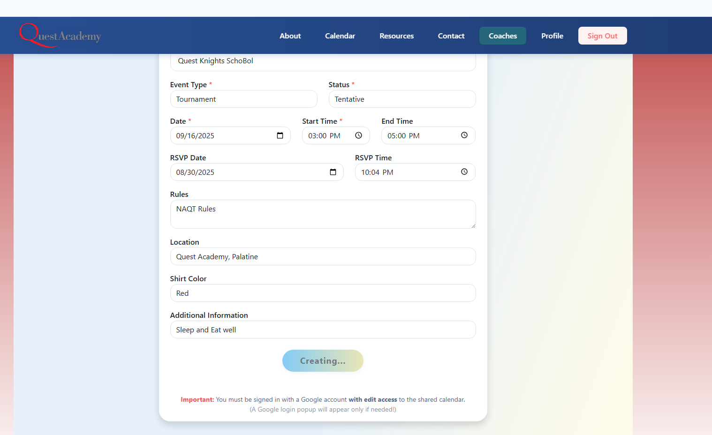

# Manual Testing Use Cases for Add Tournament Page

## UI Components

- [ ] Navbar is visible and displays correct navigation links
- [ ] TournamentForm component is visible and all form fields are present
- [ ] Footer is visible and displays expected information

## Form Functionality

- [x] User can enter tournament details in all required fields
- [ ] Form validation prevents submission with missing or invalid data
- [ ] Error messages are displayed for invalid or incomplete input
- [ ] User can successfully submit the form with valid data
- [ ] Success message or confirmation is shown after successful submission
- [ ] Form resets or clears after submission (if applicable)

### Observations
- The status was stuck creating a tournament for more than 3 minutes: 

## Navigation

- [ ] Clicking navigation links in Navbar routes to correct pages
- [ ] Any links/buttons in the form or footer work as expected

## Responsiveness & Layout

- [ ] Page layout is responsive on desktop, tablet, and mobile
- [ ] All components are properly aligned and spaced

## Edge Cases

- [ ] Page renders without errors if form data is missing or malformed
- [ ] Form handles unexpected input gracefully (e.g., special characters, long text)
- [ ] Submitting duplicate tournament data is handled appropriately
- [ ] REST Errors are reported in a user friendly and actionable way
    -  Needs to be added

## Accessibility

- [ ] All form fields are accessible via keyboard
- [ ] Labels are associated with form fields for screen readers
- [ ] Page structure is accessible for screen readers

## Performance

- [ ] Add Tournament page loads quickly without noticeable delays
- [ ] No unnecessary re-renders or console errors
