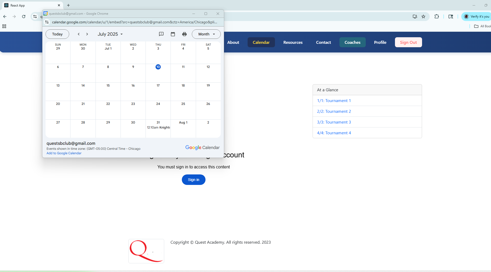
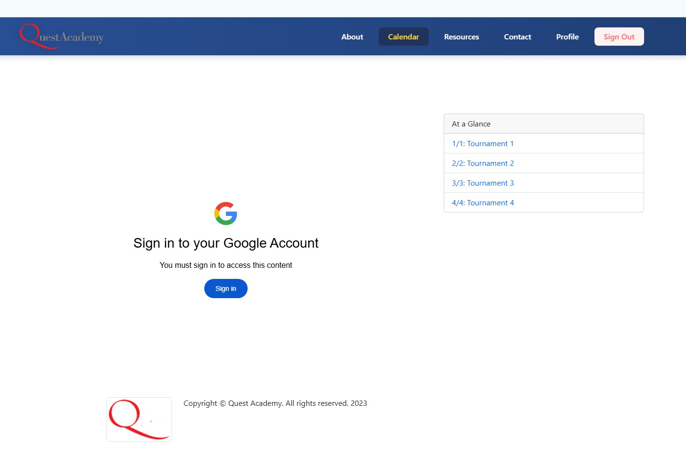

# Manual Testing Use Cases for Calendar Page

## UI Components

- [ ] Navbar is visible and displays correct navigation links
- [ ] Calendar component is visible and displays events/dates correctly
- [ ] AtAGlance component is visible and shows summary information
- [ ] Footer is visible and displays expected information

### Observations
- Calendar shows up in a different pop up: 
- Calendar does not show for non google users: 

## Navigation

- [ ] Clicking navigation links in Navbar routes to correct pages
- [ ] Links/buttons in Calendar or AtAGlance (if any) work as expected

## Responsiveness & Layout

- [ ] Calendar page layout is responsive on desktop, tablet, and mobile
- [ ] Calendar and AtAGlance components are properly aligned and spaced
- [ ] No overlapping or misaligned elements

## Edge Cases

- [ ] Page renders without errors if there are no events in Calendar
- [ ] Page renders without errors if AtAGlance has missing or unexpected data
- [ ] Components handle large number of events gracefully

## Accessibility

- [ ] All interactive elements are accessible via keyboard
- [ ] Images and icons have appropriate alt text
- [ ] Page structure is accessible for screen readers

## Performance

- [ ] Calendar page loads quickly without noticeable delays
- [ ] No unnecessary re-renders or console errors
