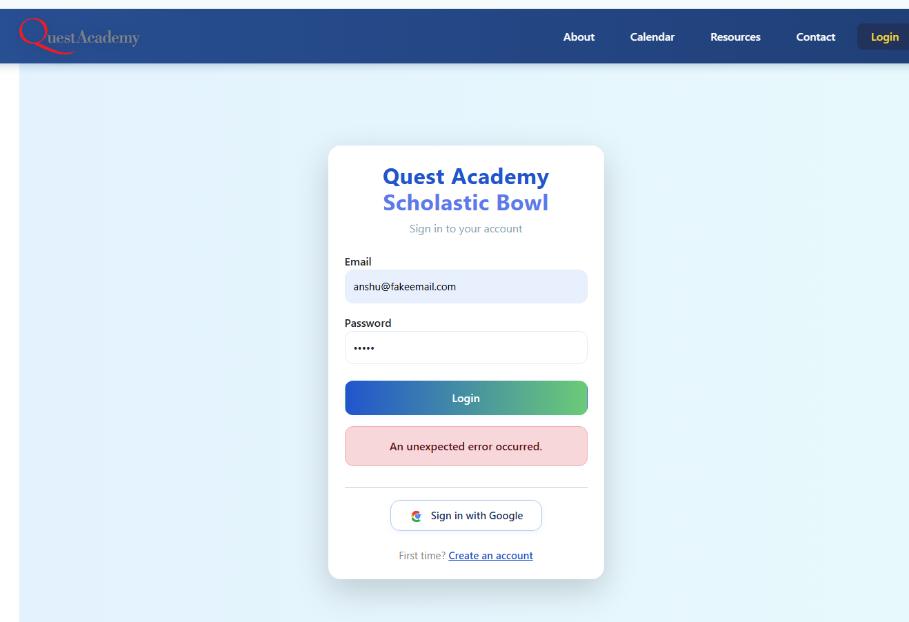

# Manual Testing Use Cases for Schobowl Quest React App

## Public Routes

- [x] Home page loads at `/`
- [x] Login page loads at `/login`
- [x] Unauthorized page loads at `/unauthorized`
- [x] About page loads at `/about`
- [x] Contact page loads at `/contact`
- [x] Resources page loads at `/resources`
- [x] Sign Up page loads at `/signup`
- [ ] Navigating to an unknown route shows Unauthorized/404 page
- [x] Clicking Quest Logo routes back to `/`

### Observations

- Footer is not consistent and aligned in all the pages
- Home page accordion not working well

## Authentication

- [x] User can log in with valid credentials
- [x] User cannot log in with invalid credentials
- [ ] After login, user is redirected to a protected route
- [x] User can log out and is redirected to login or home page
- [x] Unauthorized user cannot access protected routes

### Observations
 - Error message on invalid credentials needs to be more user friendly: 

## Protected Routes (Any Logged-in User)

- [ ] Calendar page loads at `/calendar` for logged-in users
- [x] Profile page loads at `/profile` for logged-in users
- [x] Tournament detail page loads at `/tournament/:id` for logged-in users
- [ ] Accessing protected routes without login redirects to `/login`

## Coach-Only Routes

- [ ] Coaches Only page loads at `/coaches` for coach users
- [ ] Add Tournament page loads at `/coaches/add-tournament` for coach users
- [ ] Make Teams page loads at `/coaches/make-teams` for coach users
- [ ] Manage Tournaments page loads at `/coaches/manage-tournaments` for coach users
- [ ] Coaches Calendar page loads at `/coaches/calendar` for coach users
- [ ] Non-coach users cannot access coach-only routes (redirected to `/unauthorized`)

## Navigation

- [ ] Navigation bar displays correct links for logged-in users
- [ ] Navigation bar displays correct links for coach users
- [ ] Navigation bar displays correct links for logged-out users
- [ ] Navigation links route to correct pages

## Edge Cases

- [ ] Session expires and user is redirected to login
- [ ] Direct URL access to protected/coach-only routes without login/role
- [ ] Invalid tournament ID in `/tournament/:id` shows error or fallback page

## UI/UX

- [ ] All pages render without errors
- [ ] Responsive design works on mobile and desktop
- [ ] Forms validate input and show error messages
- [ ] Loading and error states are handled gracefully
