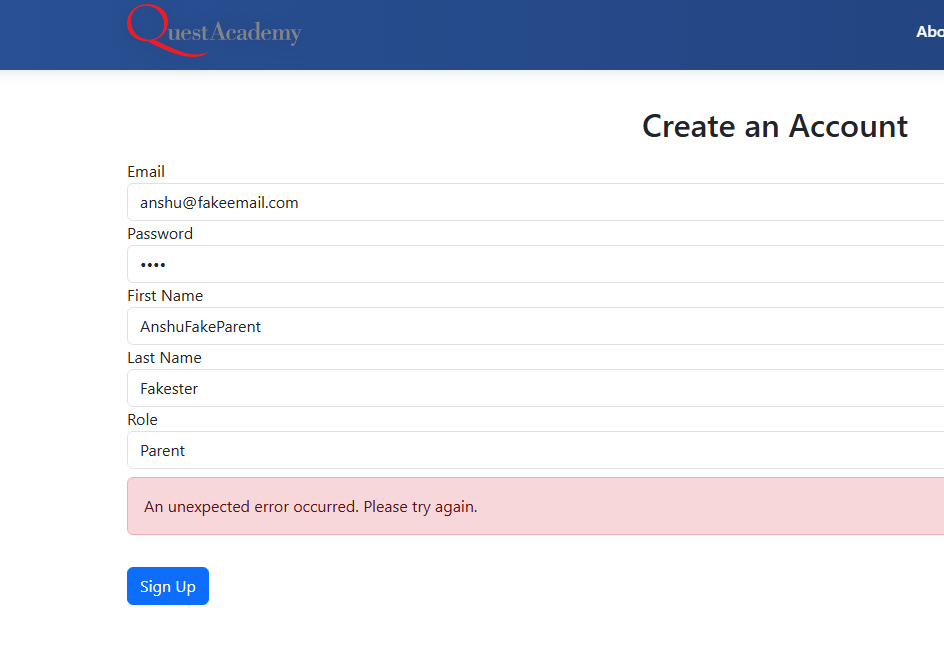
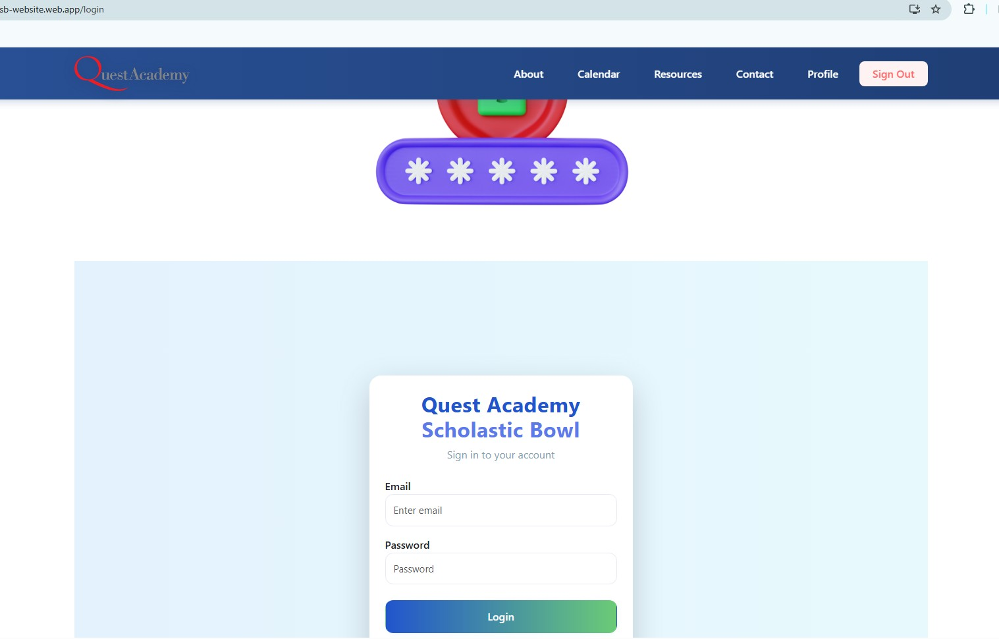

# Manual Testing Use Cases for Sign Up / Profile Completion Page

## Account Creation

- [x] Page loads and displays "Create an Account" if user is not signed in
- [ ] Page loads and displays "Complete Your Profile" if user is signed in
- [x] User can enter a valid email and password to create an account
- [ ] Error message appears if email is already in use
- [x] Error message appears for invalid email format
- [ ] Error message appears for weak password
- [x] Pop up Modal appears when user has succesfully created profile
- [x] User is redirected to home page upon acknowledgement of the modal
- [x] Homepage has Signout button as a logout option

### Observations
- email textbox should dynamically authenticate for email addr pattern. Not only on `submit` action
- when tried to set `password` to `1111` got this error
- Password verification should be added
- Viewing password `eyeball` should be added
- Rules for strong password should be specified
- Got a login page trying to navigate to calendar with non google email even when user was supposed to have been logged in 
- Login page password should also have an `eyeball` to check password

## Profile Information

- [ ] User can enter first name and last name (required)
- [ ] User can select a role (Player, Coach, Parent)
- [ ] If role is "Player", grade dropdown is visible and required
- [ ] If role is "Coach" or "Parent", grade dropdown is hidden
- [ ] Error message appears if required fields are missing

## Existing User Handling

- [ ] If already signed in, email field is pre-filled and disabled
- [ ] User can complete profile for existing account
- [ ] Error message appears if a profile already exists for the account

## Submission

- [ ] Clicking "Sign Up" or "Save Profile" submits the form
- [ ] Success message or alert appears after successful signup/profile completion
- [ ] User is redirected to home page after successful signup/profile completion

## Edge Cases

- [ ] Page renders without errors if Firestore or Auth is temporarily unavailable
- [ ] Form handles unexpected input gracefully (e.g., special characters, long text)
- [ ] Submitting duplicate profile data is handled appropriately

## Accessibility

- [ ] All form fields are accessible via keyboard
- [ ] Labels are associated with form fields for screen readers
- [ ] Page structure is accessible for screen readers

## Responsiveness & Layout

- [ ] Page layout is responsive on desktop, tablet, and mobile
- [ ] All components are properly aligned and spaced

## Performance

- [ ] Sign Up page loads quickly without noticeable delays
- [ ] No unnecessary re-renders or console errors
